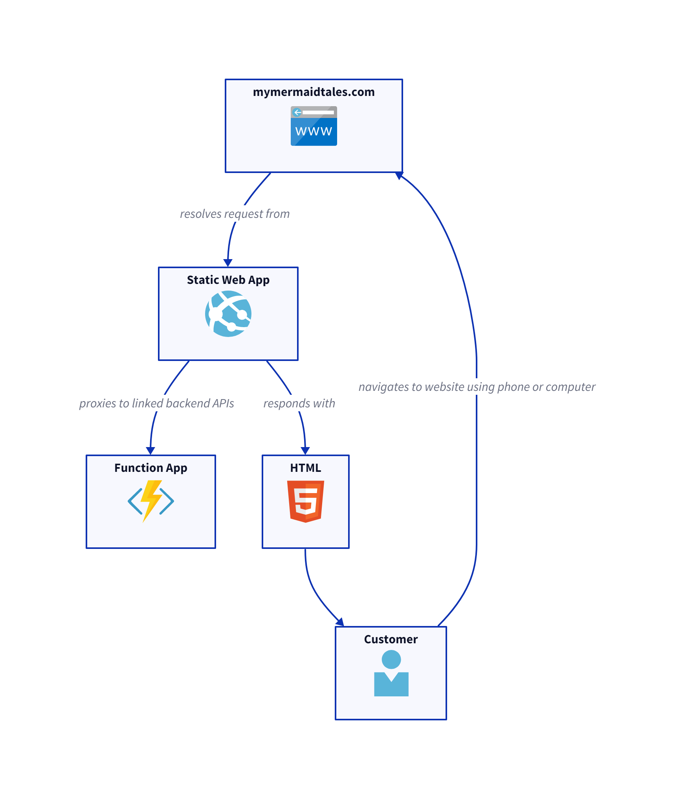
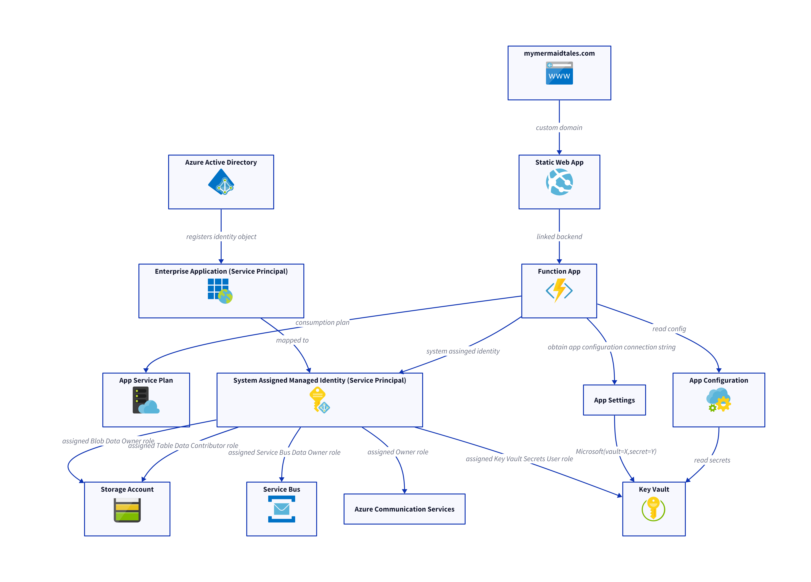
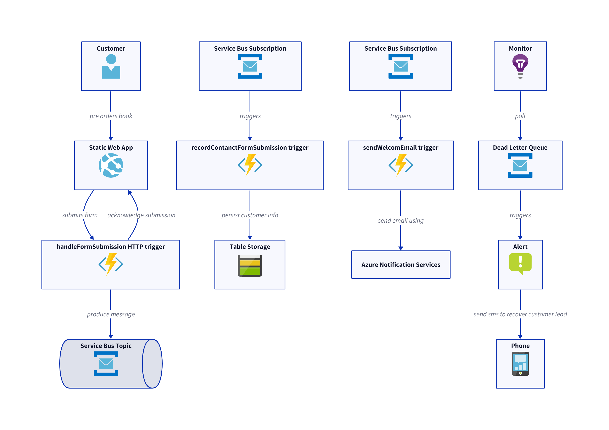

## High Level

Azure Static Web App resolves static resources such as html, css and javascript files. An Azure Function app is "linked" to the static web app so that requests directly to the static web app via routes that match ~/api/* are auto-magically proxied to the correct resource.

## Authorization

Role based access control is manged via System assigned managed identity that grants the function app permissions to perform certain actions against other resources

The function app uses a App Service Plan consumption plan. Therefore it is not "serverless" to afford more than 3 deployment slots and to avoid cold starts.

## Contact Form

The contact form represents a portion of customer funnel and is tied to the most critical objective and key result, "time to revenue."

Sending a no-reply acknowledgement email and persisting the customer information are handled via a message broker to ensure we respond to the user as quickly as possible and avoid a long running HTTP lifecycle.

Dead Letter Queue captures all the customer submissions that were not successfully processed. We monitor that queue and send texts directly to my phone to resolve.